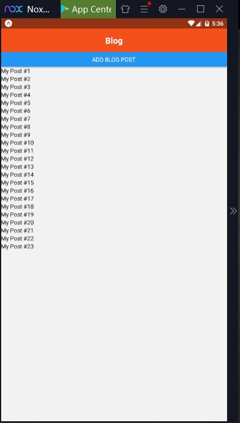
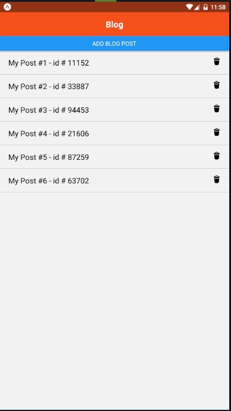
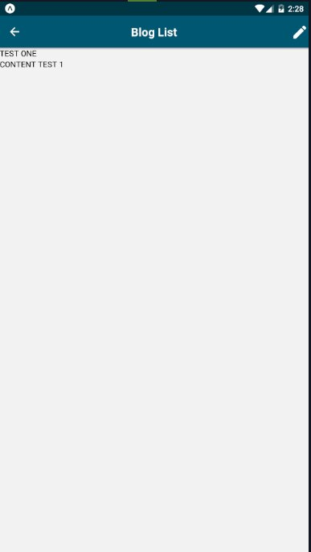
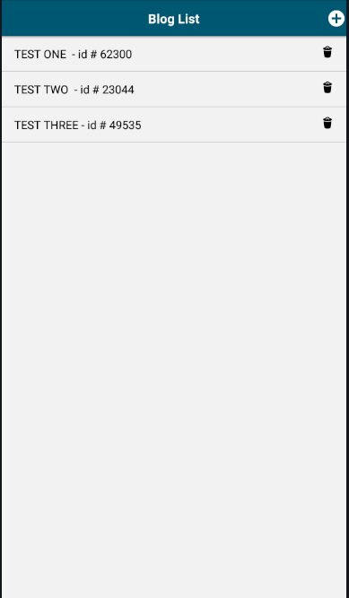
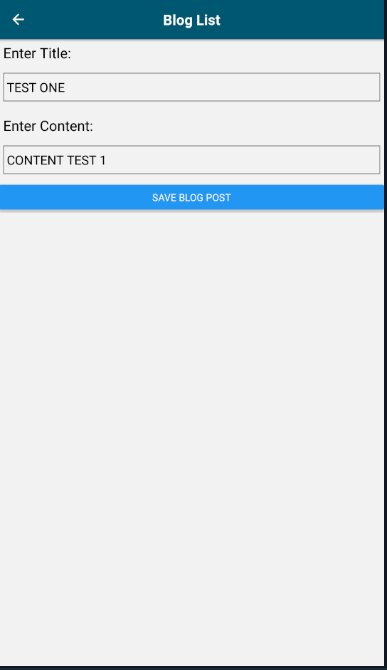

# Aplicación  Móvil de un Blog

_Aplicación realizada en Expo React Native de un Blog usando Context_

### Instalación 🔧

_Estas instrucciones te permitirán obtener una copia del proyecto en funcionamiento en tu máquina local para propósitos de desarrollo y pruebas._

Una vez clonado se pueden instalar las dependencias de la siguiente forma.

```
Yarn install o NPM install 
```
y
```
Yarn start o NPM start
```

## Construido con 🛠️


* [Expo](http://Expo.io) - Framework
* [Yarn](https://yarnpkg.com/) - Manejador de dependencias
* [NOX](https://es.bignox.com/)  Simulador


## Preview 📌






## Autores ✒️

_Menciona a todos aquellos que ayudaron a levantar el proyecto desde sus inicios_

* **Gabriel Paez** - *Trabajo Inicial* - [GABPAEZ](https://github.com/GabPaez)


También puedes mirar la lista de todos los [contribuyentes](https://github.com/your/project/contributors) quíenes han participado en este proyecto. 

## Licencia 📄

Este proyecto está bajo la Licencia (Tu Licencia) - mira el archivo [LICENSE.md](LICENSE.md) para detalles


